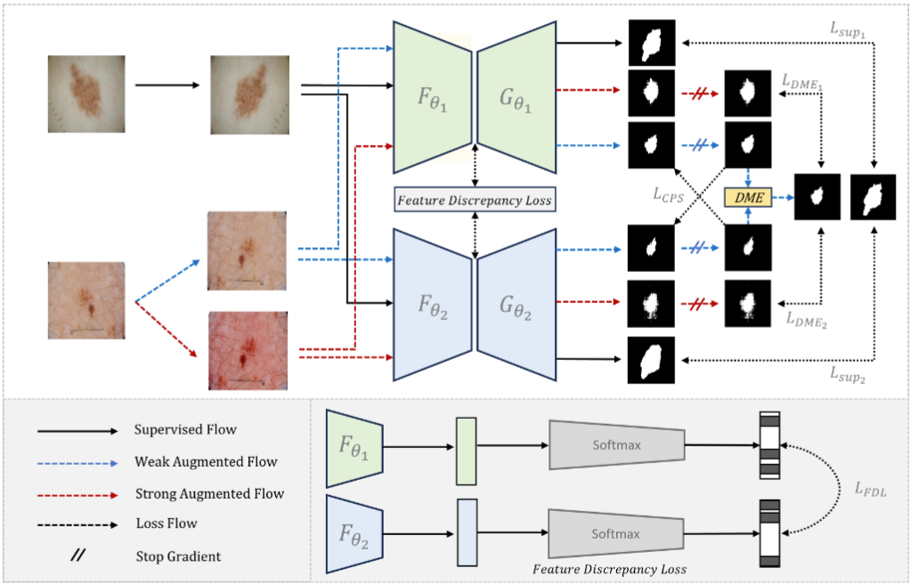

# Semi-Supervised Skin Lesion Segmentation under Dual Mask Ensemble with Feature Discrepancy Co-Training

## Introduction
Official Code by Thanh-Huy Nguyen and Hoang-Thien Nguyen et.al.

## Our Proposed Framework

<center></center>

## Requirements
This repository is based on PyTorch 1.8.0, CUDA 11.1, and Python 3.6.13. All experiments in our paper were conducted on NVIDIA GeForce RTX 3090ti GPU with an identical experimental setting.
## Usage
To config the dataset and hyperparameters,
```
Modify Configs/multi_train.local.yml
```
To train a supervised model,
```
python ./code/train_sup.py --dataset isic2018 #for ISIC 2018
python ./code/train_sup.py --dataset ham10000 #for HAM10000
```
To train a semi-supervised model,
```
python ./code/train_dme-fd.py --dataset isic2018 #for ISIC 2018
python ./code/train_dme-fd.py --dataset ham10000 #for HAM10000
``` 

## Questions
If you have any questions, welcome contact us at 'thanh-huy_nguyen@etu.u-bourgogne.fr' (Huy) or 'n21dccn080@student.ptithcm.edu.vn' (Thien)


